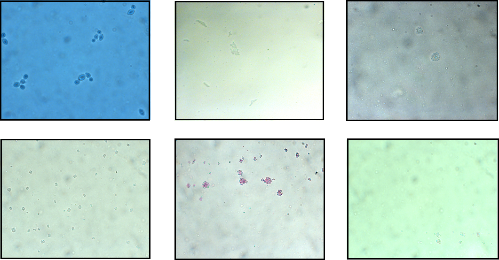

# Bacterial microcolonies classification and segmentation

## Task description

The goal is to classify bacteria type and create segmentation mask for image. Overall, there are 6 classes of bacteria.  

## Dataset description

Dataset is organized into 2 folders (train, test) and contains total 261 train and 107 test images of bacteria microcolonies made by microscope.
All images have 512x640 size. Also, train folder contains json files needed for extracting bacteria type and drawing segmentation mask.



## File Structure

```
  Project/
  │
  ├── classification.ipynb - main notebook for classification task
  ├── segmentation.ipynb - main notebook for segmentation task
  ├── EDA.ipynb - notebook with image exploration
  │
  ├── datasets.py - dataset classes
  ├── preprocessing.py - some functions helping to preprocess json files
  │
  ├── data/ - default directory for storing input data
  │   ├── train/ - contains images, masks and json files
  │   └── test/ - contatins test images and predicted masks
  │
  └── models/ - saved models
       ├── model_seg.h5 - segmentation model
       └── model_class - classification model
  ```
  
 ## Used models

For classification task I used pretrained ResNet50 model, which showed 87% accuracy on validation data.  
For segmentation task pretrained Unet with EfficientNetB3 as backbone was applied.
